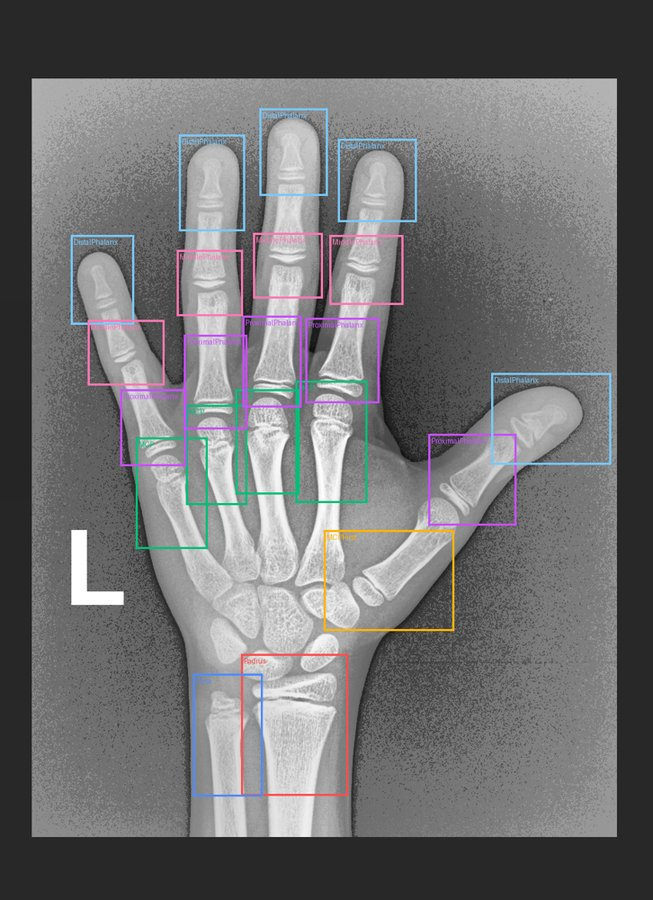
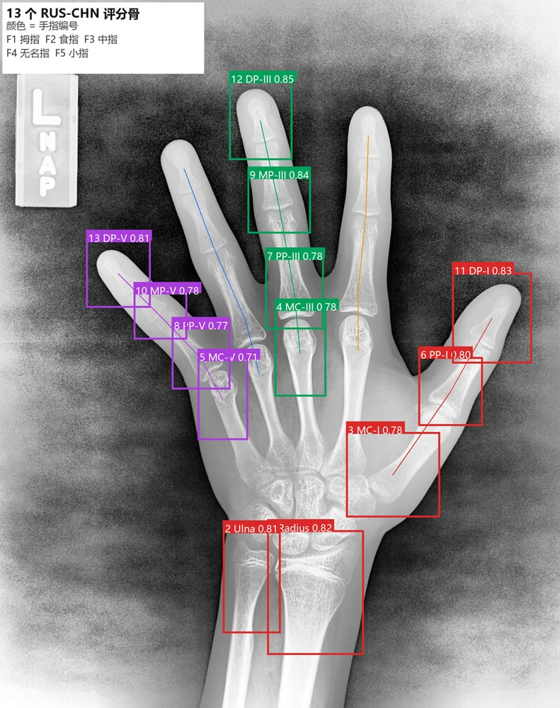
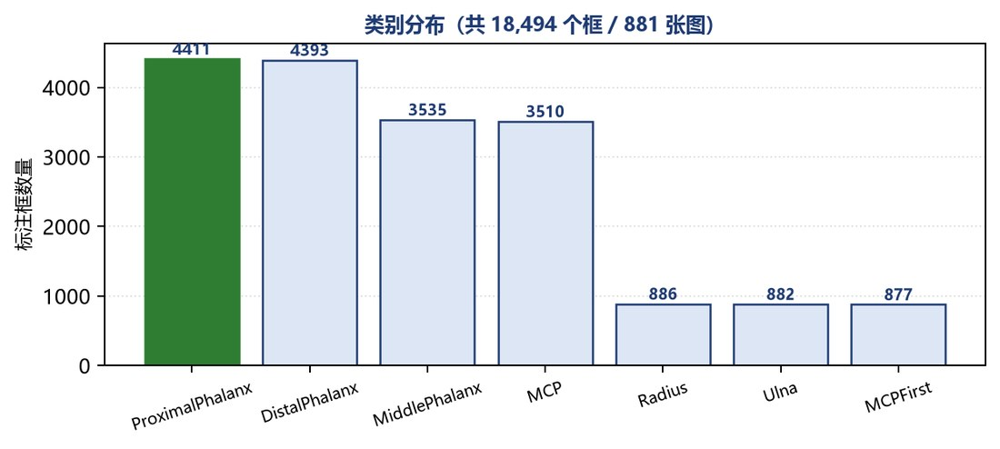
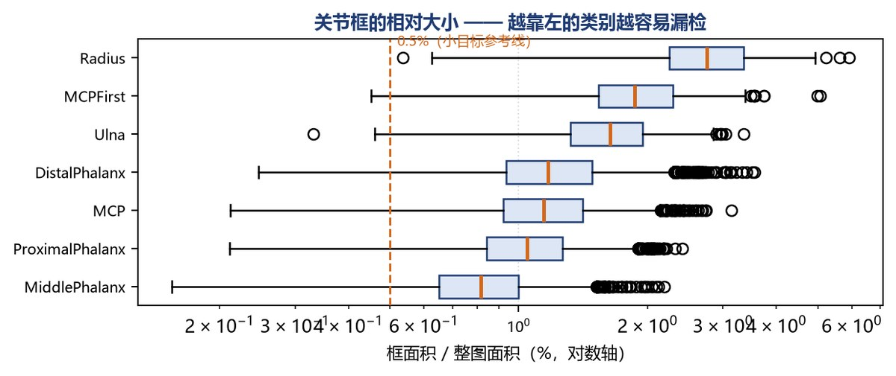
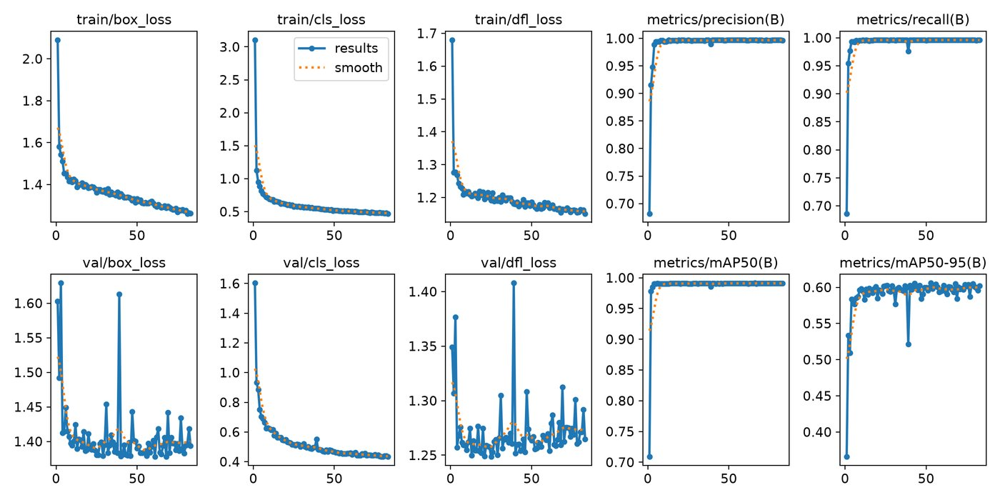
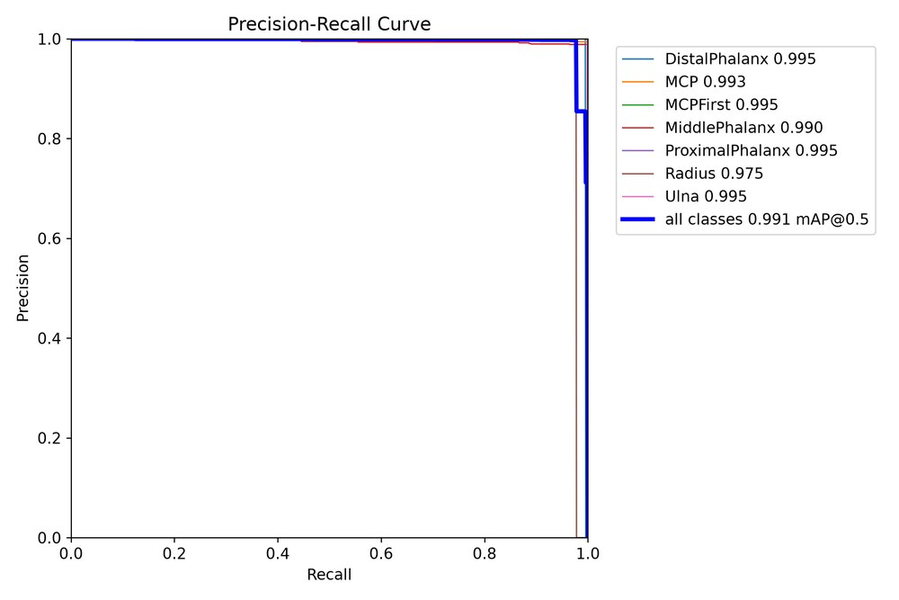

# 手骨 X 光片骨龄检测（YOLOv8 关节检测 + RUS-CHN 评分骨筛选）

> 从手部 X 光片自动定位骨龄评估所需的关节。
> 完整实现「数据探查 → 标签转换 → YOLOv8 训练 → 评估 → 13 个 RUS-CHN 评分骨筛选」。
> 重点是**数据校验**与**指标可信度**：过程中所有关键结论都有自检或复算支撑。

<p>


</p>

---

## 30 秒看懂

| 项 | 结果 |
|---|---|
| 数据 | 手部 X 光片 **881 张 / 18,494 个标注框 / 7 个类别** |
| 平均每图 | **21 个关节**（解剖学决定：5 远节 + 5 近节 + 4 中节 + 4 掌指 + 桡骨 + 尺骨 + 第一掌指） |
| 模型 | YOLOv8n，imgsz=640，batch=8，**83 轮**（早停） |
| **mAP@0.5** | **0.9912** |
| mAP@0.5:0.95 | 0.6058 |
| 精确率 / 召回率 | **0.9970 / 0.9962** |
| 训练耗时 | 约 **12 分钟**（RTX 4060 Laptop 8 GB） |
| 下游 | 从 21 个框筛出 **13 个 RUS-CHN 评分骨**，881 张全部通过组成自检 |
| 代码量 | **11 个脚本 / 约 2,100 行**（不含第三方库） |

**六个结论**（详见[实验与发现](#实验与发现)）

1. **这个任务的 mAP 高不代表模型强** —— 关节位置固定、对比度高，**第 3 轮就到最终值的 99%**
2. ⭐ **标签转换必须做往返自检** —— 尺寸读错会让标签全错，**而程序完全不报错**
3. ⭐⭐ **「框最大的类别召回率最低」是反常识的** —— 回数据里查出原因是**目标被拍出画面**
4. ⭐⭐ **小目标的问题不是"找不到"，是"框不贴合"** —— 召回率 100%，但 AP50-95 全场最低
5. ⭐⭐⭐ **混淆矩阵和 mAP 打架时，我自己复算了一遍** —— 结果证明**那张图不可用**
6. ⭐ **从 21 个框筛 13 个评分骨** —— 难点是"哪块骨属于哪根手指"，用**顺序配对**而不是距离

---

## 这是什么

```
手部 X 光片
     ↓  ① CLAHE 预处理（本仓库未启用，见「已知局限」）
     ↓  ② VOC XML → YOLO txt 标签转换  ← 含往返自检
     ↓  ③ YOLOv8 训练
21 个关节检测框（7 类 × 多实例）
     ↓  ④ 按几何关系分组到 5 根手指
13 个 RUS-CHN 评分骨（桡骨、尺骨、第 1/3/5 指的掌骨、近节、中节、远节）
     ↓  ⑤ 裁剪 → CNN 分类定级（本仓库未实现）
     ↓  ⑥ 查 RUS-CHN 评分表 → 骨龄
```

**本仓库实现了 ①②③④；⑤⑥ 是后续步骤，本次重做没有补上（见「已知局限」）。**

### 标注样例



*每张图 21 个框，7 个类别用不同颜色区分。*

### 13 个评分骨筛选结果



*颜色 = 手指编号（红 F1 拇指 / 橙 F2 食指 / 绿 F3 中指 / 蓝 F4 无名指 / 紫 F5 小指）。
注意食指和无名指只有连线、没有框 —— 因为 RUS-CHN 不评分这两根手指。*

---

## 数据

### 类别分布

| 类别 | 中文 | 数量 | 每张图 |
|---|---|---|---|
| `ProximalPhalanx` | 近节指骨 | 4411 | 5 |
| `DistalPhalanx` | 远节指骨 | 4393 | 5 |
| `MiddlePhalanx` | 中节指骨 | 3535 | 4 |
| `MCP` | 掌指关节 | 3510 | 4 |
| `Radius` | 桡骨 | 886 | 1 |
| `Ulna` | 尺骨 | 882 | 1 |
| `MCPFirst` | 第一掌指关节 | 877 | 1 |
| **合计** | | **18,494** | **21** |



### 数据画像（`src/stage1_explore_data.py`）

**先建立"数据的画像"再谈模型** —— 这一阶段只回答"数据长什么样"，不碰模型。

| 统计项 | 结果 | 说明 |
|---|---|---|
| 图片数 | 881 | |
| 标注框数 | 18,494 | |
| 平均每图框数 | **21.0** | 解剖学决定，不是巧合 |
| **图片尺寸种类** | **514 种** | 最多的是 2040×2570（170 张）、1514×2044（157 张） |
| 横竖屏混排 | 有 | 2040×2570 与 2570×2040 同时存在 |

### 数据的四个问题

**① 类别严重不平衡：4411 : 877 ≈ 5 : 1**

但这个不平衡是**解剖学决定的** —— 每只手只有 1 个桡骨，却有 5 个远节指骨。
所以**不做重采样**（那会破坏真实先验），而是**在评估时按类别分别看指标**。

**② 图片尺寸有 514 种，且横竖屏混排**

训练时必须统一尺寸，但**不能直接拉成正方形** —— 那会改变骨骼的长宽比例，
而骨龄判读恰恰依赖骨的比例。YOLO 用的是 **letterbox**：保持宽高比缩放 + 补边。

**③ 有脏标注**

发现 **2 个退化框**（宽 5–6 像素、高 0 像素）：

```
14783.xml  DistalPhalanx    w=5 h=0
14822.xml  ProximalPhalanx  w=6 h=0
```

已在标签转换脚本里过滤。**发现方式值得一提**：我在统计框的宽高比时程序报 `ZeroDivisionError`
——**这个报错本身就是线索**。

**④ 小目标比例不低**

| 类别 | 平均占整图面积 | 面积 < 0.5% 的框 |
|---|---|---|
| **MiddlePhalanx** | **0.84%** ← 最小 | **292 个（8%）** |
| ProximalPhalanx | 1.07% | 153 个（3%） |
| MCP | 1.18% | 72 个（2%） |
| DistalPhalanx | 1.24% | 82 个（2%） |
| Ulna | 1.64% | 2 个 |
| MCPFirst | 1.94% | 1 个 |
| Radius | 2.79% ← 最大 | 0 个 |



**这张图是后面解释"小目标为什么难"的证据** —— 而不是停留在"小目标就是难"这种空话。

---

## 技术流程

| 步骤 | 脚本 | 行数 | 做什么 |
|---|---|---|---|
| ① 数据探查 | `src/stage1_explore_data.py` | 254 | 类别/尺寸/框数/框面积四项统计 + 可视化 |
| ② 标签转换 | `src/stage2_voc2yolo.py` | 253 | VOC→YOLO、train/val 划分、**往返自检** |
| ③ 训练 | `src/stage3_train.py` | 119 | 训练 + 验证 + 分类别指标落盘 |
| ③' 分析 | `src/analyze_full.py` | 95 | 收敛速度、过拟合、最优点分析 |
| ④ 推理缓存 | `src/stage4_infer.py` | 99 | 批量推理 + 结果缓存（避免重复跑） |
| ⑤ 筛选 | `src/stage5_select13.py` | 274 | 手指分组 + RUS-CHN 映射 + **组成自检** |
| ⑤' 可视化 | `src/stage5b_draw13.py` | 151 | 13 关节筛选结果标注图 |
| 支持 | `src/download_weights.py` | 85 | 带镜像和重试的权重下载 |
| 支持 | `src/make_docs_figs.py` | — | 生成 README 配图 |

### 快速开始

```bash
python -m venv .venv
.venv\Scripts\Activate.ps1

# 1) 先装 GPU 版 PyTorch（不是默认 PyPI 源）
pip install torch torchvision --index-url https://download.pytorch.org/whl/cu126
# 2) 再装其余依赖
pip install -r requirements.txt

# 3) 指定数据目录（VOC2007 的上一级）
$env:BONE_DATA_ROOT = "D:\your_dataset"

# 4) 依次运行
python src/stage1_explore_data.py     # 数据探查
python src/stage2_voc2yolo.py         # 标签转换（含往返自检）
python src/download_weights.py        # 下载 yolov8n.pt（带镜像）
python src/stage3_train.py --epochs 100 --patience 30 --name full
python src/analyze_full.py            # 收敛分析
python src/stage4_infer.py            # 批量推理 + 缓存
python src/stage5_select13.py         # 13 关节筛选
python src/stage5b_draw13.py          # 结果可视化
```

> **⚠️ 数据未包含在仓库中**（约 1.4 GB 手部 X 光片，涉及医学影像数据授权）。
> 仓库只包含代码。数据按标准 VOC 格式组织：
> ```
> <BONE_DATA_ROOT>\
>   └── VOC2007\
>         ├── Annotations\   *.xml   881 个（VOC 标注）
>         └── JPEGImages\    *.png   881 个（与 XML 同名）
> ```
> **把 `BONE_DATA_ROOT` 环境变量指向该目录即可**，`stage1` / `stage2` 都会读它。
> 不设的话默认找 `data/raw/VOC2007/`，找不到会给出明确的提示。

### 类别索引约定

**⚠️ 这个顺序必须和 `configs/bone_age.yaml` 里的 `names` 完全一致**，
否则模型学到的类别会整体错位 —— 而且训练照跑、loss 照降、结论全错。

```yaml
names:
  0: DistalPhalanx      # 远节指骨
  1: MCP                # 掌指关节
  2: MCPFirst           # 第一掌指关节
  3: MiddlePhalanx      # 中节指骨
  4: ProximalPhalanx    # 近节指骨
  5: Radius             # 桡骨
  6: Ulna               # 尺骨
```

`configs/bone_age.yaml` 由 `stage2_voc2yolo.py` **自动生成**（含本机绝对路径），
所以没有进仓库。

---

## 实验与发现

### ① ⭐ 标签转换的静默错误陷阱

这一步看着简单，但藏着一个**程序不会报错**的坑。

YOLO 标签是**归一化**的，所以公式里的 `W`、`H` 必须是**每张图各自的真实尺寸**：

```
cx = (xmin + xmax) / 2 / W
cy = (ymin + ymax) / 2 / H
w  = (xmax - xmin) / W
h  = (ymax - ymin) / H
```

**如果偷懒用了默认值（比如 640×640），会怎么样？**

```
程序不报错 ❌
标签文件正常生成 ✅
YOLO 正常开始训练 ✅
loss 正常下降 ✅
但所有框都在错误的位置 ❌
最终 mAP 很低 ❌
而你不知道是标签错了 ❌
```

**所以我写了一个【往返自检】：把生成的 YOLO 标签反算回绝对像素坐标，和原 XML 逐一比对。**

```python
rx1 = (cx - bw / 2) * W
ry1 = (cy - bh / 2) * H
rx2 = (cx + bw / 2) * W
ry2 = (cy + bh / 2) * H
err = max(abs(rx1 - x1), abs(ry1 - y1), abs(rx2 - x2), abs(ry2 - y2))
```

**结果**：

```
抽查框数        3359
最大像素误差    0.002140 px
✅ 全部对得上 —— 转换逻辑正确
```

**这个数字不是"很小"这么简单 —— 它是信息论下限**：

```
归一化坐标用 6 位小数存储 → 可表达的精度 = 1e-6 × 图片宽度

宽度 1426 → 1e-6 × 1426 = 0.001426 px
宽度 2040 → 1e-6 × 2040 = 0.002040 px     ← 最宽的一档
实测        0.002140 px                    ← 和理论上限吻合
```

**0.002 像素对检测任务完全没有意义** —— 没有人能标得比这更准。
**能解释误差的来源，而不只是说"误差很小"，才是真的理解了数值精度。**

**顺带修掉的问题**：过滤掉 2 个退化框（宽或高 ≤ 0 的脏标注）。
不过滤的话会生成 `h=0` 的标签，既不合法也可能让 loss 出问题。

### ② ⭐⭐ 「框最大的类别，召回率反而最低」

分类别指标出来后，有一个**反常识**的现象：

```
Radius:  召回率 0.9778   ← 全场最低
         AP50-95  0.6684  ← 全场最高
```

**桡骨的框是最大的（平均占整图 2.79%），按常识它最不该漏检。**

我回数据里统计了各类别框**贴图像边缘**的比例：

| 类别 | 总数 | 贴边 | 贴边率 | **贴下边缘** |
|---|---|---|---|---|
| **Radius** | 886 | 32 | **3.6%** | **32（100%）** |
| **Ulna** | 882 | 27 | **3.1%** | **27（100%）** |
| DistalPhalanx | 4393 | 35 | 0.8% | 0（贴的是左右上边）|
| ProximalPhalanx | 4411 | 0 | 0.0% | 0 |
| MiddlePhalanx | 3535 | 0 | 0.0% | 0 |
| MCP | 3510 | 0 | 0.0% | 0 |
| MCPFirst | 877 | 0 | 0.0% | 0 |

**原因清楚了**：桡骨和尺骨在手腕下方，**X 光片拍摄时经常把它们的远端切掉**。
被裁掉的目标模型看不到完整形态 → 漏检 → 拉低召回率。

**为什么 AP50-95 反而最高？** 因为一旦完整可见，它的框最大、定位最准。
**两个指标合起来看，是完全自洽的。**

### ③ ⭐⭐ 小目标的问题不是"找不到"，是"框不贴合"

```
MiddlePhalanx:  召回率 1.0000    ← 一个都没漏
                AP50-95 0.5557   ← 全场最低
```

**它回答了"小目标到底难在哪"这个笼统的问题：**

> **不是"找不到"（mAP@0.5 = 0.9899、召回率 100%），而是"框不贴合"（AP50-95 最低）。**

**而这和第一步的数据探查完全对上** —— 中节指骨平均只占整图 **0.84%**，
是全场最小的一类，而且有 292 个框面积小于 0.5%。

**⇒ 如果要提升它，方向不是"提高召回"，而是"提高定位精度"
（提高 imgsz、或在损失里加大它的权重）。**

### ④ ⭐ 训 83 轮和训 5 轮几乎没区别

| 指标 | 5 轮 | **83 轮** | 变化 |
|---|---|---|---|
| mAP@0.5 | 0.9906 | **0.9912** | **+0.0006** |
| mAP@0.5:0.95 | 0.5936 | **0.6058** | +0.0122 |
| 精确率 | 0.9906 | **0.9970** | +0.0064 |
| 召回率 | 0.9922 | **0.9962** | +0.0040 |

**收敛分析**（`src/analyze_full.py`）：

```
mAP@0.5        首次达到最终值 99% 的轮次：第 3 轮
mAP@0.5:0.95   首次达到最终值 99% 的轮次：第 9 轮
```



**后面 70 多轮只带来 +0.012 的提升 —— 这个任务对 yolov8n 来说太简单了，模型容量是过剩的。**

**过拟合检查**：

```
train/box_loss  最低 1.2611（第 81 轮）  最终 1.2629
val/box_loss    最低 1.3779（第 61 轮）  最终 1.3936   ← 只回升 1.1%
```

train loss 一直在降、val loss 没有跟着回升 → 没有明显过拟合。
**但"train loss 还在降、val loss 不动"本身就是容量过剩的信号。**

### ⑤ ⭐⭐⭐ 混淆矩阵和 mAP 打架，我自己复算了一遍

**这是整个项目里最值得讲的一件事。**

训练完成后，我看到两个**互相矛盾**的数字：

```
mAP 报告：      精确率 0.9970   召回率 0.9962
混淆矩阵图：     对角线只有 0.47
```

**如果 P 和 R 都是 0.99，混淆矩阵对角线不可能只有 0.47。必有一个是错的。**

**第一步：不二选一，自己写脚本复算**

绕开 `val` 流程，用 `predict` + 自己写的 IoU 贪心匹配（`src/stage3e_final_cm.py`），
在**全量 176 张验证图**上跑：

```
conf=0.25,  IoU≥0.45：对角线平均 1.00
conf=0.001, IoU≥0.45：对角线平均 0.97
```

**和 mAP 一致 ✓ 和那张热力图不一致。**

**第二步：去找那张图"不可信"的硬证据**

看**未归一化**的计数矩阵，发现 background 列：

```
Row DistalPhalanx → 638
Row MCP           → 1219
Row Radius        → 686
...  合计 ≈ 6576

但验证集总共只有 176 张 × 21 个框 = 3,692 个真实框
```

**6576 > 3692 —— 数学上不可能。**

**交叉验证**：同一张图里 `True=DistalPhalanx` 这一列合计 **884**，
而预期是 `4393 × 20% = 879` —— **类别列的计数是对的，只有 background 列是错的。**

**第三步：读源码定位机制**

```
models/yolo/detect/val.py:259
    self.confusion_matrix.process_batch(predn, pbatch, conf=self.args.conf)
                                                        ↑ 只传 conf，没传 iou_thres
        · val 的默认 conf 是 0.001（不是 0.25）
        · metrics.py:454 的匹配【不看类别、只按 IoU 贪心】
        · postprocess 里 multi_label=True —— 一个框可以同时输出多个类别
```

**第四步：实测验证这个机制**

```
     conf      总框    同类重复对    异类重复对
    0.001     844        0           19      ← 同一个框被输出成不同类别
    0.01      438        0            0      ← 消失
    0.05      420        0            0
    0.25      420        0            0
```

**机制确认**：`multi_label=True` + `conf=0.001` 会产生"同一个框、不同类别"的重复检测。
这些重复项的 IoU 完全相同，而混淆矩阵的匹配既不分类别、排序在打平时也不保证选对
—— 于是正确的那条被错类的那条挤掉，对角线就崩了。
**而 mAP 是"按类别分开匹配"的，完全不受影响。**

**结论与边界**：

> **以自己复算的结果为准，那张热力图在这个场景下不可用。**
>
> **但我必须说明：我没能逐位复现它那个 0.47 的数字。**
> 我定位到了机制、也实测验证了现象，但结论只到"这张图不可用"，
> **不到"我知道它为什么恰好是这个数"。**

### ⑥ ⭐ 从 21 个框筛 13 个评分骨：用「顺序」而不是「距离」

**RUS-CHN（CHN-05 法）评分的是这 13 块骨：**

```
桡骨、尺骨                                     2
第 1、3、5 掌骨（MC I / III / V）                3
第 1、3、5 近节指骨（PP I / III / V）            3
第 3、5 中节指骨（MP III / V）                   2
第 1、3、5 远节指骨（DP I / III / V）            3
                                           ─────
                                             13
```

**注意：只取第 1、3、5 指，第 2、4 指不评分。**
所以食指和无名指的一个框都不选 —— **这是对的**。

#### 难点在哪

模型给的是「7 个类别、21 个实例」，而 RUS-CHN 要的是「**哪根手指**的哪类关节」
—— 中间缺了「手指编号」这个信息。

**如果只按类别名去查，会踩一个很隐蔽的坑**：

```
MCP 有 4 个实例、ProximalPhalanx 有 5 个实例。
按类别名逐个取 → 每次都命中【同一个框】
→ 13 个位置里只有 6 个是不同的关节，其余 7 个是重复的
```

**而且程序不报错、数量确实等于 13、后面也能拼起来跑** ——
是个典型的静默错误，**最后表现为骨龄分数把同一个关节算了好几遍**。

#### 解决方案

```
① 手轴 = 腕部中心(桡骨+尺骨) → 掌部中心(所有掌指关节)
② 垂直轴 = 手轴旋转 90°                （对图像旋转不变）
③ 拇指（手指 1）由 MCPFirst 直接标识
④ 另外 4 个 MCP 是第 2/3/4/5 指的锚点
⑤ 每块指骨按垂直坐标排序后，【按顺序】配对给各手指
⑥ 自检：每根手指的构成必须恰好是
     手指 1（拇指）：MCPFirst + ProximalPhalanx + DistalPhalanx
     手指 2~5      ：MCP + ProximalPhalanx + MiddlePhalanx + DistalPhalanx
```

**第 ⑤ 步是关键。** 我第一版是「每块指骨找最近的 MCP 锚点」，**通过率只有 1.4%**：

```
14714:
  手指3: 实际只有 ['MCP', 'ProximalPhalanx']          ← 太少
  手指5: 实际有 8 个框（3 个远节 + 2 个中节 + ...）    ← 全挤到一根手指上
```

**根因**：手指往指尖方向会**扇形展开** ——
中指远节的垂直坐标可能比无名指的 MCP 更"靠边"，于是被分到错误的手指上。

**改成"按顺序配对"之后，通过率 100%（881/881）。**

> ⭐ **一句话总结：'谁离谁近'会随着展开而失效，'谁在谁左边'不会。**

#### ⚠️ 一个方法论上的坑

**按顺序配对之后，自检就变成了"同义反复"** ——
只要各排的数量对（99.2% 的图都对），每根手指的组成就**必然**正确。
**所以"自检 100%"不再能证明分组正确。**

**我另外做了目视验证**（`src/stage5b_draw13.py`），确认：
手指编号、桡/尺侧、每条链（掌→近→中→远）的连贯性都正确。

> **一个"总是通过"的检查等于没有检查。检查必须有独立的失效路径。**

#### 一个必须注明的近似

数据里**没有单独的「掌骨」类别**，只有掌指关节（`MCP` / `MCPFirst`）。
RUS 评分掌骨时看的是**掌骨头部的骨骺**，而掌指关节的框正好覆盖这个区域，
所以用 MCP 近似 MC 是合理的 —— **但这是近似。**

---

## 评估结果

**验证集**：176 张 / 3692 个框（按 8:2 随机划分，seed=42）

| 指标 | 值 |
|---|---|
| **mAP@0.5** | **0.9912** |
| mAP@0.5:0.95 | 0.6058 |
| 精确率 | 0.9970 |
| 召回率 | 0.9962 |

**分类别：**

| 类别 | P | R | AP50 | AP50-95 |
|---|---|---|---|---|
| ProximalPhalanx | 0.9999 | 1.0000 | 0.9950 | 0.6079 |
| DistalPhalanx | 0.9998 | 0.9955 | 0.9950 | 0.6151 |
| MCPFirst | 0.9993 | 1.0000 | 0.9950 | 0.5857 |
| **Radius** | 0.9987 | **0.9778** ← 最低 | 0.9750 | **0.6684** ← 最高 |
| Ulna | 0.9984 | 1.0000 | 0.9950 | 0.6067 |
| MCP | 0.9942 | 1.0000 | 0.9936 | 0.6010 |
| **MiddlePhalanx** | 0.9885 | 1.0000 | 0.9899 | **0.5557** ← 最低 |



**13 关节筛选**：881 张图**全部**通过组成自检，100% 选出 13 个评分骨。

**检测稳定性**：99.2%（874/881）的图**七类框数量完全正确**。

---

## 目录结构

```
bone-age-yolo/
├── src/
│   ├── stage1_explore_data.py    ① 数据探查（254 行）
│   ├── stage2_voc2yolo.py        ② 标签转换 + 往返自检（253 行）
│   ├── stage3_train.py           ③ 训练 + 评估（119 行）
│   ├── stage3c_probe_cm.py       ④ 混淆矩阵探针：手工重算（143 行）
│   ├── stage3d_probe_cm_cause.py ④ 混淆矩阵探针：机制验证（89 行）
│   ├── stage3e_final_cm.py       ④ 混淆矩阵探针：全量复算（105 行）
│   ├── stage4_infer.py           ⑤ 批量推理 + 缓存（99 行）
│   ├── stage5_select13.py        ⑥ 13 关节筛选（274 行）
│   ├── stage5b_draw13.py         ⑥ 结果可视化（151 行）
│   ├── analyze_full.py           收敛速度 / 过拟合分析（95 行）
│   ├── download_weights.py       带镜像的权重下载（85 行）
│   └── make_docs_figs.py         生成 README 配图
├── configs/
│   └── bone_age.yaml             YOLO 数据集配置（自动生成，未进仓库）
├── docs/                         README 配图（压缩后共约 600 KB）
├── data/                         数据集（1.4 GB，未进仓库）
├── outputs/                      训练产物 / 推理缓存（未进仓库）
└── requirements.txt
```

### 关键产出

```
outputs/
├── data_report/
│   ├── 01_class_dist.png            类别分布
│   ├── 02_boxes_per_image.png       每图框数
│   ├── 03_image_sizes.png           尺寸散点
│   ├── 04_box_scale.png         ★  框的相对大小（解释小目标问题的证据）
│   ├── data_meta.json               结构化元信息
│   ├── stage2_summary.json          往返自检结果
│   └── select13_report.json         13 关节逐图结果
├── detections/all_detections.json   881 张图的检测缓存（2.5 MB）
├── joint_filter/                    13 关节筛选结果图
└── runs/full/                       权重 / 混淆矩阵 / PR 曲线 / results.csv
```

---

## 关键设计决策

| 决策 | 理由 |
|---|---|
| **先做数据探查，不直接训练** | 不知道数据有什么，出了问题连该怀疑哪一类都不知道 |
| **标签转换必须做往返自检** | 尺寸读错会让标签全错，**而程序完全不报错** |
| **用硬链接而不是复制图片** | 数据 1.45 GB；`os.link()` 不占额外空间，失败时回退 `copy2()` |
| **类别不平衡不重采样** | 这个不平衡是解剖学决定的，抹平它会破坏真实先验；改成按类别看指标 |
| **先跑 5 轮冒烟测试** | 长任务拆成"先验证能跑通"和"再跑完整"两段 |
| **推理结果缓存成 JSON** | 从"每次都跑 3 分钟"变成"秒开" |
| **13 关节用顺序配对而非最近距离** | 手指会扇形展开，"谁离谁近"会失效，"谁在谁左边"不会 |
| **自检之外还要目视验证** | 一个"总是通过"的检查等于没有检查 |
| **发现指标矛盾时自己复算** | 不二选一信一个；还要能找出"哪个不可能"的硬证据 |
| **承认没完全复现的数字** | 结论只到"这张图不可用"，不到"我知道它为什么是这个数" |

---

## 已知局限

- **链路不完整** —— 只做到「检测 + 筛选 13 个评分骨」。
  **分类定级和查表算骨龄没有实现**（分类数据在 `arthrosis/` 目录里，是 9 类关节按等级分的切图）。
- **单一模型** —— 只训了 `yolov8n`，没有 mAP / 速度 / 显存的横向对比曲线。
- **没有做 CLAHE 预处理** —— 完整的骨龄流程里这一步在标签转换之前。
  我这次没做，而 mAP@0.5 已经到 0.99 了，
  所以 **"CLAHE 到底有没有用"是个未验证的问题**（值得做对照实验）。
- **数据来源单一** —— 881 张只做过随机 train/val 划分，
  没有按设备 / 年龄段做分层验证，**不能保证跨中心泛化**。
- **13 关节筛选没有严格准确率** —— 因为缺少「哪块骨属于哪根手指」的人工标注。
  我能证明的是：881 张全部通过组成自检 + 抽样目视验证正确。
- **mAP@0.5:0.95 偏低（0.606）** —— 说明框的贴合精度还有提升空间。
- **验证集较小（176 张）** —— 最小的类别只有 176 个框，
  所以分类别指标不宜精确到小数点后太多位。

---

## 下一步

- [ ] **补 CLAHE 对照实验** —— 完整流程里有这一步，值得量化它的收益
- [ ] **提升 mAP@0.5:0.95** —— 提高 imgsz（640 → 960）、换 `yolov8s`
- [ ] **补小关节分类** —— 用 `arthrosis/` 的数据训 CNN，输出 1~8 级
- [ ] **补查表算骨龄** —— 按 RUS-CHN 评分表加权求和
- [ ] **模型横向对比** —— yolov8n / s / m 在 mAP、速度、显存上的权衡曲线
- [ ] **消融实验** —— 用 / 不用 CLAHE、Mosaic 增强的影响

---

## 数据来源与授权

- **代码**：MIT
- **数据**：手部 X 光片数据集，**未包含在本仓库中**。
  医学影像涉及隐私与数据授权，请自行准备符合规范的数据，
  并确保符合所在机构的数据使用政策。
- 本项目的代码实现与实验分析为个人独立完成；
  所使用的骨龄评估标准（CHN-05 / RUS-CHN）为公开发表的行业标准。
